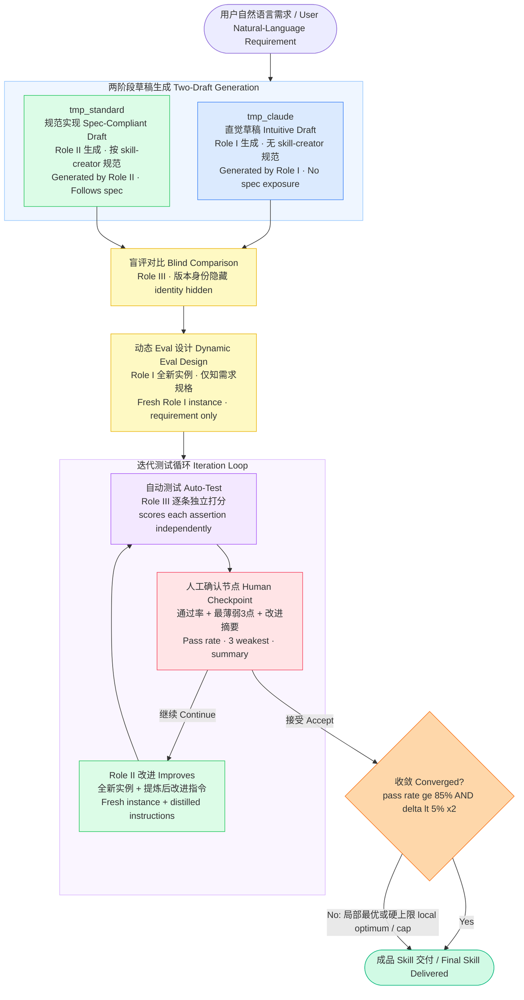

# skill-cooker 🍳

[](https://opensource.org/licenses/MIT)
[](https://claude.ai/code)
[]()
[]()

**把自然语言需求"烹饪"成标准化、经过测试的高质量 Claude skill。**

Turn natural-language requirements into standardized, tested, high-quality Claude skills.

---

## 它能解决什么问题 / What problem does it solve

写一个好用的 Claude skill，通常需要深度理解 skill-creator 规范、设计 eval assertions、知道如何迭代测试——这些门槛把绝大多数潜在的 skill 创作者挡在了门外。

skill-cooker 把这些全部自动化：你只需要用自然语言描述"我想要一个做什么的 skill"，它负责两阶段草稿生成、盲评对比、动态测试设计、迭代改进，最终交付一个经过充分检验的成品。

Writing a good Claude skill typically requires deep familiarity with the skill-creator spec, designing eval assertions, and knowing how to iterate on tests — a barrier that keeps most potential skill authors out.

skill-cooker automates all of this. Just describe in natural language what you want a skill to do. It handles two-draft generation, blind comparison, dynamic test design, and iterative improvement — delivering a thoroughly validated skill.

---

## 工作原理 / How it works

skill-cooker 的核心是**两阶段草稿 + 认知隔离**的架构：



The architecture's key innovation is **cognitive isolation between roles**: Role I (intuitive draft) never sees the skill-creator spec; Role II (standard implementation) never sees tmp_claude; Role III (evaluator) never generates skill content. Each subagent runs in a fresh, blank context window — preventing the self-validation bias that plagues single-instance generation.

---

## 完整模式 vs 降级模式 / Full Mode vs Degraded Mode

| 功能 / Feature | 完整模式 Full Mode (Claude Code) | 降级模式 Degraded Mode (Claude.ai) |
|---------------|--------------------------------|-----------------------------------|
| 认知隔离 Cognitive isolation | ✅ 真正空白上下文窗口 | ⚠️ 强制遗忘声明（近似） |
| 两阶段对比价值 Draft comparison | ✅ 完整 | ⚠️ 有限（同实例生成） |
| 并行执行 Parallel execution | ✅ 3-A 和 3-B 并行 | ❌ 串行 |
| 文件持久化 File persistence | ✅ 文件系统 | ✅ Artifacts storage |
| 交付方式 Delivery | ✅ bash 文件操作 | ✅ present_files 下载 |
| 收敛判断 Convergence logic | ✅ 完整 | ✅ 完整 |
| 人工确认节点 Human checkpoints | ✅ 完整 | ✅ 完整 |

**推荐在 Claude Code 中使用以获得完整效果。**
Full Mode in Claude Code is recommended for best results.

---

## 快速开始 / Quick Start

### 前提条件 / Prerequisites

- [Claude Code](https://claude.ai/code) 已安装
- [skill-creator](https://github.com/anthropics/skill-creator) 已安装（skill-cooker 依赖它）
- Claude Pro 或 Max 订阅，或 Anthropic API Key

### 安装 / Installation

**全局安装（推荐）/ Global install (recommended):**

```bash
mkdir -p ~/.claude/skills/skill-cooker/references
curl -o ~/.claude/skills/skill-cooker/SKILL.md \
  https://raw.githubusercontent.com/chong/skill-cooker/main/skill-cooker/SKILL.md
curl -o ~/.claude/skills/skill-cooker/references/roles.md \
  https://raw.githubusercontent.com/chong/skill-cooker/main/skill-cooker/references/roles.md
curl -o ~/.claude/skills/skill-cooker/references/eval-schema.md \
  https://raw.githubusercontent.com/chong/skill-cooker/main/skill-cooker/references/eval-schema.md
curl -o ~/.claude/skills/skill-cooker/references/convergence.md \
  https://raw.githubusercontent.com/chong/skill-cooker/main/skill-cooker/references/convergence.md
```

**项目级安装 / Project-level install:**

```bash
mkdir -p .claude/skills/skill-cooker/references
# 同上，将 ~/.claude 替换为 .claude
```

### 使用 / Usage

在 Claude Code 中，直接用自然语言描述你想要的 skill：

In Claude Code, just describe the skill you want in natural language:

```
帮我做一个能把 CSV 转换成 Markdown 报告的 skill
```

```
Help me create a skill that converts CSV files into Markdown reports
```

skill-cooker 会自动完成剩余的一切，并在两个关键节点等待你的确认。

skill-cooker handles everything else and pauses at two checkpoints for your confirmation.

---

## 设计约束 / Design Constraints

skill-cooker 的行为由 9 条显式约束驱动，确保结果可预期、可重复：

1. **环境前置检查** — 环境不满足时立即中止，不静默降级
2. **最低可执行性预检** — tmp_claude 必须有 name、description 和行为步骤
3. **Assertion 数量门槛** — 少于 5 条时强制补充
4. **双收敛条件** — 通过率 ≥ 85% AND 连续两轮改善 < 5%
5. **局部最优处理** — 停滞时报告状态，不强制继续
6. **最大迭代硬上限** — 5 轮后暂停，请用户决策
7. **结构化 diff 呈现** — 被删除内容单独列出请用户确认
8. **文件操作原子性** — 备份验证后再删除，冲突检查前置
9. **subagent 上下文边界显式声明** — 每个角色的允许/禁止内容明确定义

---

## 项目结构 / Project Structure

```
skill-cooker/
├── SKILL.md                    # 主 skill 文件（中文版）
├── SKILL.en.md                 # 英文版
└── references/
    ├── roles.md                # 三角色上下文边界清单
    ├── eval-schema.md          # eval 格式规范
    └── convergence.md          # 收敛判断完整逻辑
```

---

## 常见问题 / FAQ

**Q: 为什么需要 skill-creator？**
skill-cooker 的第二步（生成 tmp_standard）依赖 skill-creator 的规范和流程。它是 skill-cooker 的"标准食谱"。

**Q: Why does skill-cooker need skill-creator?**
Step 2 of skill-cooker (generating tmp_standard) relies on skill-creator's spec and workflow. It serves as skill-cooker's "standard recipe."

**Q: 在 Claude.ai 中效果如何？**
可以运行，但认知隔离缺失。两个草稿由同一个 Claude 实例生成，对比价值有限。建议在 Claude Code 中使用完整模式。

**Q: How well does it work on Claude.ai?**
It runs, but without cognitive isolation. Both drafts are generated by the same Claude instance, so comparison value is limited. Claude Code with Full Mode is recommended.

**Q: 生成的 skill 质量如何？**
对于流程型、输入输出结构清晰的 skill，质量可接近人工花费较长时间精心设计的水平。对于判断密集型 skill（评估类、创意类），skill-cooker 更适合作为高质量起点加速器。

**Q: What's the quality of generated skills?**
For process-oriented skills with clear input/output structure, quality can approach that of a carefully hand-crafted skill. For judgment-intensive skills (evaluation, creative tasks), skill-cooker works best as a high-quality starting-point accelerator.

---

## 贡献 / Contributing

欢迎提交 Issue 和 Pull Request！请先阅读 [CONTRIBUTING.md](CONTRIBUTING.md)。

Issues and pull requests are welcome! Please read [CONTRIBUTING.md](CONTRIBUTING.md) first.

---

## 许可证 / License

MIT License — see [LICENSE](LICENSE) for details.

---

## 作者 / Author

**chong**

---

*skill-cooker is an independent project and is not affiliated with Anthropic.*
